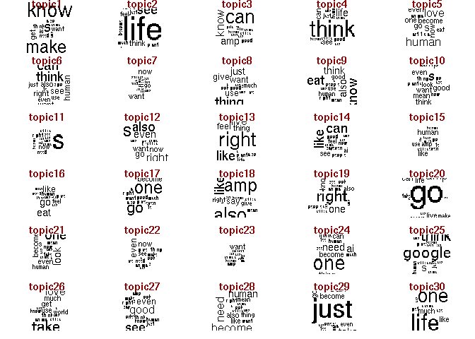

# Quick LDA Example  

This project is developed explicitly to play around with NLP.
Specifically, showcasing some easy LDA (Latent Dirichlet Allocation).  
This technique is described in this
[paper](https://www.jmlr.org/papers/volume3/blei03a/blei03a.pdf?ref=https://githubhelp.com).
To interpret topic models, you might want to have a look at this other
[paper](https://proceedings.neurips.cc/paper/2009/file/f92586a25bb3145facd64ab20fd554ff-Paper.pdf).  
Since this project is just a toy example, I decided to interpret the
model based on intuition (you might want to be more rigorous).

### The question: “Is lamda sentient today?”

I want to know what people (on Twitter) say (think?) about lamda
today.  
So, I’m using Twitter’s API to download people’s tweets related to lamda
or sentient ai and model their discourse using topic modeling.

### First, get the data!

I’m downloading English-only tweets (but no retweets) containing
“lambda” or “sentient” in the form of a simple word or hashtag. I’m
limiting my query to tweets posted today.  
Downloading tweets is very easy if you have a Twitter developer account.
To do so, you can leverage the magic provided by the academictwitteR R
package.

The full query in Twitter jargon is this:  
“(#lamda OR lamda OR #sentient OR sentient) lang:en -is:retweet”

    ## query:  (#lamda OR lamda OR #sentient OR sentient) lang:en -is:retweet 
    ## Total pages queried: 1 (tweets captured this page: 496).
    ## Total pages queried: 2 (tweets captured this page: 499).
    ## Total pages queried: 3 (tweets captured this page: 500).
    ## Total pages queried: 4 (tweets captured this page: 269).
    ## This is the last page for (#lamda OR lamda OR #sentient OR sentient) lang:en -is:retweet : finishing collection.

### Load the data

The academictwitteR R package has a very handy function,
“bind_tweets”.  
By specifying the location of the downloaded tweets, the function load
everything in a very tidy tabular format.

``` r
#retrieve tweets and format as tibble
lamda_dat <- bind_tweets(data_path = "lamda_data", output_format = "tidy")
```

The very tidy tibble contains the tweet itself along with many info
(tweet id, timestamp, how many times it was re-tweeted, etc…).

    ## # A tibble: 1,764 × 24
    ##    tweet_id            created_at     retweet_count like_count text  conversation_id possibly_sensit…
    ##    <chr>               <chr>                  <int>      <int> <chr> <chr>           <lgl>           
    ##  1 1554310954187476996 2022-08-02T03…             0          2 "Goo… 15543109541874… FALSE           
    ##  2 1554310831772676097 2022-08-02T03…             0          0 "Goo… 15543108317726… FALSE           
    ##  3 1554310340908765184 2022-08-02T03…             0          1 "The… 15543103398936… FALSE           
    ##  4 1554310295132090368 2022-08-02T03…             0          0 "@se… 15523496858132… FALSE           
    ##  5 1554310020258762752 2022-08-02T03…             0          2 "- t… 15543100170752… FALSE           
    ##  6 1554309920178454528 2022-08-02T03…             0          3 "i c… 15543099201784… FALSE           
    ##  7 1554309704657956864 2022-08-02T03…             2          3 "@Sa… 15542549567937… FALSE           
    ##  8 1554309676845727745 2022-08-02T03…             0          0 "I w… 15543096768457… FALSE           
    ##  9 1554309438453846016 2022-08-02T03…             0          1 "He … 15543083594775… FALSE           
    ## 10 1554309341666230274 2022-08-02T03…             0          3 "@Bl… 15460407806528… FALSE           
    ## # … with 1,754 more rows, and 17 more variables: in_reply_to_user_id <chr>, lang <chr>,
    ## #   source <chr>, user_created_at <chr>, user_protected <lgl>, user_verified <lgl>,
    ## #   quote_count <int>, user_tweet_count <int>, user_list_count <int>, author_id <chr>,
    ## #   user_followers_count <int>, user_following_count <int>, sourcetweet_type <chr>,
    ## #   sourcetweet_id <chr>, sourcetweet_text <chr>, sourcetweet_lang <chr>,
    ## #   sourcetweet_author_id <chr>

### Formatting

It might be convenient to run some mild pre-processing (dealing with
datetime is always painful).  
Plus, I want to extract information such as the hour and minute of the
timestamp in two different variables.

``` r
#format and clean
lamda_dat <- lamda_dat %>%
  mutate(
    #date in date format
    created_at = gsub(pattern = "T", replacement = " ", x = created_at), #"T" to space
    created_at = gsub(pattern = "\\.(.*)Z", replacement = "", x = created_at), #remeove everything between "." and "Z"
    created_at = as.POSIXct(x = created_at, format = "%Y-%m-%d %H:%M:%S", tz = "GMT"),
    #extract day
    created_day = as.POSIXct(x = gsub(pattern = " (.*)$", replacement = "", x = as.character(created_at)),
                             format = "%Y-%m-%d", tz = "GMT"),
    #extract time
    created_time = gsub(pattern = "^(.*) ", replacement = "", x = as.character(created_at)),
    #extract hour
    created_hour = gsub(pattern = "^(.*) ", replacement = "", x = as.character(created_at)),
    created_hour = gsub(pattern = ":(.*)$", replacement = "", x = created_hour),
    created_hour = as.numeric(created_hour),
    #extract minute
    created_minute = gsub(pattern = "^(.*) ", replacement = "", x = as.character(created_at)),
    created_minute = gsub(pattern = "^[0-9][0-9]:|:[0-9][0-9]$", replacement = "", x = created_minute),
    created_minute = as.numeric(created_minute),
    #extract weekday
    created_weekDay = weekdays(x = created_at),
    #create day bin (15 min)
    created_dayBin = ((created_hour * 60) + created_minute) / 15 %>% round(digits = 1)
  )
```

### Quick summary

The first thing I’d like to do is to summarize the tweets corpus.  
Just checking how many tweets are there, how many unique users, and so
on…

    ## [1] "unique tweets: 1764"

    ## [1] "unique users: 1474"

    ## [1] "unique conversations: 1530"

### Quick glance at the time distribution

The second thing I’d like to do with these data is looking at their time
distribution.  
You know, just to have a look at peak time and so on… The red dashed
lines isolate generic “working hours”. And then, a fancy “clock plot”!
Why not!?

``` r
linPlot <- ggplot(data = lamda_dat,
       aes(x = created_at)) +
  geom_histogram(bins = 24, color = "black", fill = NA) +
  geom_vline(xintercept = as.POSIXct("2022-08-02 08:00:00 GMT", tz = "GMT"),
             lty = "dashed", color = "red") +
  geom_vline(xintercept = as.POSIXct("2022-08-02 18:00:00 GMT", tz = "GMT"),
             lty = "dashed", color = "red") +
  labs(x = "date / time") +
  ggtitle(label = "tweets frequency - timeseries")
circularPlot <- ggplot(data = lamda_dat,
       aes(x = created_hour %>% as.numeric(),
           group = created_day)) +
  geom_histogram(bins = 24, color = "black", fill = NA) +
  geom_vline(xintercept = c(8, 18), lty = "dashed", color = "red") +
  labs(x = "hour") +
  coord_polar(start = -(pi / 20)) +
  ggtitle(label = "tweets frequency - on the clock")
linPlot + circularPlot
```


### Some real text preprocessing

Let’s start with something easy:

-   Remove emojis  
-   Remove new lines  
-   Remove trailing and leading spaces

``` r
#clean text vector
lamda_dat <- lamda_dat %>%
  mutate(
    #copi text vector
    textVector = text, 
    #remove emojis
    textVector = gsub(pattern = "\\p{So}", replacement = "", x = textVector, perl = TRUE),
    #remove new line (using spaces, will be handeld by str_squish)
    textVector = gsub(pattern = "\n", replacement = " ", x = textVector), 
    #remove trailing/leading and multiple spaces
    textVector = str_squish(string = textVector)
    )
```

Then, store the text of the tweets in a single vector (textVector),
extract all unique characters, and create a new vector containing only
the allowed characters (letters and number)  
This vector of valid characters will be handy later.

``` r
#store text in a vector
textVector <- lamda_dat$text
#extract symbols vector (useful later)
symbVct <- str_split(string = textVector, pattern = "") %>% unlist() %>% unique()
symbVct <- symbVct[!(symbVct %>% grepl(pattern = "[0-9]|[a-z]|[A-Z]"))]
```

To conveniently process text data, I use the udipipe (universal
dependency) R package.  
It has many convenient functions (i.e., for lemmatization) and several
well maintained pre-trained models based on manually annotated textual
datasets.  
Moreover, these models are available in several languages. This time
however, the whole corpus is in English.  
Now, it’s useful to leverage one of the pre-trained model created from
Twitter data.  
So, let’s download the model first, and store it into an R object.

``` r
#download model
engModelInfo <- udpipe_download_model(language = "english", overwrite = FALSE)
#load model
engModel <- udpipe_load_model(file = engModelInfo$file_model)
```

The udpipe_annotate function conveniently annotates the corpus.  
The code below extract different parts of speech. It splits every tweet
into tokens (i.e., single words) and lemmas (i.e., “haven’t” becomes
“have” + “not”), and tags everything with the proper part of speech
(i.e., nouns, pronouns, verbs, etc…).  
A column storing the document id (doc_id) is created as well as columns
storing paragraph or sentence id.  
For this project, I’ll work using lemmas (which convey meaning).

``` r
#annotate
annotatedCorpus <- udpipe_annotate(object = engModel, x = textVector, trace = 1000)
```

    ## 2022-08-03 21:52:11 Annotating text fragment 1/1764
    ## 2022-08-03 21:52:33 Annotating text fragment 1001/1764

``` r
#format
annotatedCorpus <- as_tibble(annotatedCorpus)
```

### Text preprocessing

Now, it is time for some heavy preprocessing!  
The code below removes punctuation, stopwords (functional words that do
not convey meaning), invalid characters (see the symbVct vector above),
and other useless words (i.e., “<https://>” for links).  
Obviously, the keyword for the query are removed.

``` r
#text cleaning
annotatedCorpus <- annotatedCorpus %>%
  #to lower
  mutate(
    token = tolower(token),
    lemma = tolower(lemma)) %>%
  dplyr::filter(!is.na(lemma)) %>% #remove empty lemmas
  dplyr::filter(!(upos == "PUNCT")) %>% #remove punctuation
  #remove "'" from lemma and tokens
  mutate(token = gsub(pattern = "'", replacement = "", x = token),
         lemma = gsub(pattern = "'", replacement = "", x = lemma)) %>%
  #remove italian stopwords
  dplyr::filter(!(token %in% stopwords::stopwords(language = "en"))) %>%
  dplyr::filter(!(lemma %in% stopwords::stopwords(language = "en"))) %>%
  #remove wymbols (except # and @)
  dplyr::filter(!(token %in% symbVct)) %>%
  dplyr::filter(!(lemma %in% symbVct)) %>%
  #remove empty token\lemma
  dplyr::filter(token != "") %>%
  dplyr::filter(lemma != "") %>%
  #remove links
  dplyr::filter(!grepl(pattern = "https://", x = token)) %>%
  dplyr::filter(!grepl(pattern = "https://", x = lemma))
#text manual override (keywords from query)
annotatedCorpus <- annotatedCorpus %>%
  mutate(lemma = gsub(pattern = "#lamda|#sentient|lamda|sentient", replacement = NA, x = lemma)) %>%
  dplyr::filter(!is.na(lemma))
```

### Exploration

Then, let’s have a look at the most frequent words.  
These are the most frequent words, used at least 50 times.


And then, let’s create a term frequency-inverse document frequency.  
This gives us a measure of the relative importance of every single word
within a document.

``` r
#tf_idf
corpus_tfIdf <- annotatedCorpus %>%
  dplyr::select(doc_id, lemma) %>%
  group_by(doc_id, lemma) %>%
  summarise(count = n()) %>%
  ungroup() %>%
  bind_tf_idf(term = lemma, document = doc_id, n = count) %>%
  arrange(desc(tf_idf))
```

    ## `summarise()` has grouped output by 'doc_id'. You can override using the `.groups` argument.

``` r
corpus_tfIdf
```

    ## # A tibble: 24,044 × 6
    ##    doc_id  lemma            count    tf   idf tf_idf
    ##    <chr>   <chr>            <int> <dbl> <dbl>  <dbl>
    ##  1 doc11   @azragames           1     1  7.47   7.47
    ##  2 doc1133 octopuse             1     1  7.47   7.47
    ##  3 doc1227 @akikoyoshimura3     1     1  7.47   7.47
    ##  4 doc1665 tasy                 1     1  7.47   7.47
    ##  5 doc219  @myraquestion        1     1  7.47   7.47
    ##  6 doc227  futubot              1     1  7.47   7.47
    ##  7 doc616  insectoid            1     1  7.47   7.47
    ##  8 doc1074 theanything_bot      1     1  6.78   6.78
    ##  9 doc1540 @ericswalwell        1     1  6.78   6.78
    ## 10 doc167  vocaloid             1     1  6.78   6.78
    ## # … with 24,034 more rows

Finally, prior to diving into topic modeling, the annotated corpus
should be transformed in a document/term matrix (excluding too rare
words, below 50 instances).

``` r
#creates matrix
#document term frequency
dtf <- document_term_frequencies(x = annotatedCorpus,
                                 document = "doc_id", term = "lemma")
#document-term matrix
dtm <- document_term_matrix(x = dtf)
#remove non frequent words
dtm <- dtm_remove_lowfreq(dtm = dtm, minfreq = 50)
```

### Topic Modeling

This technique requires the number of topics to be provided a-priori.
However, this number can be estimated trying several values and picking
the one that provides the best value for some evaluation metrics (i.e.,
Semantic Coherence).  
The searchK function does exactly this. It test several number of topics
(the K argument) and returns performance metrics for each value.

``` r
#probe potential values of k
kSearch <- searchK(documents = asSTMCorpus(documents = dtm)$documents, #documents
                   vocab = asSTMCorpus(documents = dtm)$vocab, #vocabulary
                   data = asSTMCorpus(documents = dtm)$data, #metadata (no data in this case)
                   K = c(10, 15, 20, 25, 30, 35), #potential values of k
                   cores = maxCores, #number of cores parallelization
                   proportion = .2, #proportion of held-out samples
                   heldout.seed = 42)
```

    ## Using multiple-cores.  Progress will not be shown.

``` r
#visualize search k
plot(kSearch)
```


Looking at the plots, 30 topics seems like a reasonable number.  
Residuals, Held-Out Likelihood, and Semantic Coherence have decent
values.

### Fitting the Model

Based on the K value obtained in the previous step, it’s now time to fit
the model!  
A Latent Dirichlet Allocation model is really easy to fit (asssuming you
know how many topics are there!).  
I used K=30 (from the previous step), and alpha=.10. The alpha parameter
refers to the Dirichlet distribution. A relatively low value of alpha
promotes *“quasi-sparse”* allocation probabilities. It means that each
tweet will have a relatively high probability of being assigned to one
topic and relatively low probability of being assigned to the remaining
topics (LDA topic models are mixed-membership models!).

``` r
#train best model
ldaModel <- LDA(x = dtm,
                #best number of topics from cross-validation
                k = 30,
                method = "Gibbs",
                control = list(
                  #dirichlet alpha parameter from cross-validation
                  alpha = .10, #keep first topic pro high, and second low
                  burnin = 2000, best = TRUE, keep = 50))
```

After the model is fitted, the following custom functions can be used to
extract the most important keywords, some tweets as topic exemplars, and
create wordclouds.  
These techniques might help in interpreting the model. However, more
scientific approaches such as word-intrusion or topic-intrusion should
be preferred.

``` r
#utility functions
createKeywordCloud <- function(topic_id, w = 10, model = ldaModel){
  #create wordcloud of w keywords for topic_id by posterior
  words = posterior(model)$terms[topic_id, ]
  topwords = head(sort(words, decreasing = TRUE), n = w)
  return(wordcloud(words = names(topwords), topwords#, scale = c(1.75, 1.75)
                   ))
}
keywordPosterior <- function(topic_id, w = 10, model = ldaModel){
  #extract top w keywords for topic_id ordered by posterior
  words = posterior(model)$terms[topic_id, ]
  topwords = head(sort(words, decreasing = TRUE), n = w)
  return(topwords)
}
extractExemplarDoc <- function(topic_id, exemplars = 10, model = ldaModel){
  #extract (id and posterior of the) most representative documents (n = exemplars) of a given topic (topic_id)
  words = posterior(model)$terms[, topic_id]
  ret = names(head(sort(words, decreasing = TRUE), n = exemplars))
  ret = as.numeric(ret)
  return(ret)
}
```

Let’s extract the top 10 keywords for each topic.

    ## # A tibble: 10 × 30
    ##    Topic1 Topic2 Topic3     Topic4 Topic5 Topic6 Topic7 Topic8 Topic9 Topic10 Topic11 Topic12 Topic13
    ##    <chr>  <chr>  <chr>      <chr>  <chr>  <chr>  <chr>  <chr>  <chr>  <chr>   <chr>   <chr>   <chr>  
    ##  1 use    life   people     people get    like   become can    thing  world   google  human   one    
    ##  2 good   see    can        think  mean   feel   now    animal make   s       ai      mean    s      
    ##  3 life   can    make       take   just   can    want   thing  give   amp     s       s       use    
    ##  4 know   one    know       life   say    think  go     just   eat    good    say     much    right  
    ##  5 make   say    amp        can    human  human  need   want   know   even    now     also    like   
    ##  6 s      human  good       see    love   see    one    give   also   mean    see     right   look   
    ##  7 one    know   ai         good   s      right  see    use    think  think   need    even    live   
    ##  8 get    live   also       human  even   want   take   much   good   want    right   go      feel   
    ##  9 ai     love   animal     just   become also   use    good   human  look    also    now     world  
    ## 10 want   think  artificial ai     go     even   ai     s      use    thing   amp     want    thing  
    ## # … with 17 more variables: Topic14 <chr>, Topic15 <chr>, Topic16 <chr>, Topic17 <chr>,
    ## #   Topic18 <chr>, Topic19 <chr>, Topic20 <chr>, Topic21 <chr>, Topic22 <chr>, Topic23 <chr>,
    ## #   Topic24 <chr>, Topic25 <chr>, Topic26 <chr>, Topic27 <chr>, Topic28 <chr>, Topic29 <chr>,
    ## #   Topic30 <chr>

Keywords importance is estimated using the posterior probability from
the LDA model.

    ## # A tibble: 300 × 4
    ##    topic  rank keyword posterior
    ##    <int> <int> <chr>       <dbl>
    ##  1     1     1 use        0.208 
    ##  2     1     2 good       0.145 
    ##  3     1     3 life       0.136 
    ##  4     1     4 know       0.118 
    ##  5     1     5 make       0.109 
    ##  6     1     6 s          0.0909
    ##  7     1     7 one        0.0729
    ##  8     1     8 get        0.0279
    ##  9     1     9 ai         0.0189
    ## 10     1    10 want       0.0189
    ## # … with 290 more rows

And visualized graphically.


Similarly, extracting tweet exemplars for each topic can help making
sense of the model.  
(note: the original tweet is displayed instead of the preprocessed
version)

``` r
#extract best exemplars for each topic
exemplarPerTopic <- c()
for(indx in 1:30){ #for each topic, extract some exemplar
  #extract text index
  topic_exemplars <- extractExemplarDoc(topic_id = indx, exemplars = 10, model = ldaModel) #extract exemplars index
  #extract exemplar and attach topic id
  tmpExemplar <- cbind("topic" = indx,
                       "exemplar" = textVector[topic_exemplars])
  #store tmpExemplar into exemplarPerTopic
  exemplarPerTopic <- rbind(exemplarPerTopic, tmpExemplar)
}; rm(indx, tmpExemplar)
exemplarPerTopic <- exemplarPerTopic %>% #format properly
  as_tibble() %>%
  mutate(topic = as.integer(topic)) %>%
  arrange(topic)
head(exemplarPerTopic, n = 20)
```

    ## # A tibble: 20 × 2
    ##    topic exemplar                                                                                    
    ##    <int> <chr>                                                                                       
    ##  1     1 "Robots, chat bots can’t be sentient! https://t.co/R4hqTMOueG"                              
    ##  2     1 "@AzraGames But what if I am sentient?"                                                     
    ##  3     1 "@minda28 More controversial thought - the sentient being passed generationally and Wall-E …
    ##  4     1 "@RangapandaAU @Tim_jbo yes there is a difference: the sentient being on the right is not a…
    ##  5     1 "Good Evening Sentient Beings,\nCheck out this piping hot asset by Andryuha1981\nhttps://t.…
    ##  6     1 "\"Google's 'Sentient' Chatbot Is Our Self-Deceiving Future\"  https://t.co/C6DYRZXAdz"     
    ##  7     1 "@RedFox_64 I think it’s because digimon don’t have wifi. As I understand them, they are se…
    ##  8     1 "I sloppily move and begin to slither but a sentient ape proceeds and blushes towards me."  
    ##  9     1 "@SamDavi99667843 @FL480 yes there is a difference: the sentient being on the right is not …
    ## 10     1 "Good Evening Sentient Creatures,\nCheck out this boss asset by Andryuha1981\nhttps://t.co/…
    ## 11     2 "@elonmusk “Our?” You mean Your bubble, as You watch Your country’s poverty explode, involv…
    ## 12     2 "@MJJoyceCrowley PART 36: Crowley's tattoo is sentient. Maybe."                             
    ## 13     2 "He does remind me of Pi Kapps and Lamda Chis that I’ve went to school with\n\n#TheBachelor…
    ## 14     2 "\"Animals are sentient beings who thrive on affection\""                                   
    ## 15     2 "i can remember my grade school days well minus the people in it\n\nbut earlier than that i…
    ## 16     2 "@redthebedbug @jenny2x4 She's becoming sentient, we need to end the experiment"            
    ## 17     2 "\"Google's 'Sentient' Chatbot Is Our Self-Deceiving Future\"  https://t.co/C6DYRZXAdz"     
    ## 18     2 "Good Evening Sentient Beings,\nCheck out this piping hot asset by Andryuha1981\nhttps://t.…
    ## 19     2 "Google’s AI chatbot—sentient and similar to ‘a kid that happened to know physics’—is also …
    ## 20     2 "@SamDavi99667843 @FL480 yes there is a difference: the sentient being on the right is not …

Wordclouds are generally a messy visualization, but sometimes they can
be useful.  
The most important words per topic are visualized in the cloud.


